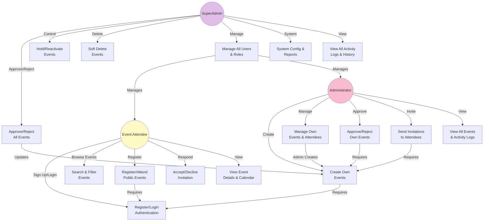
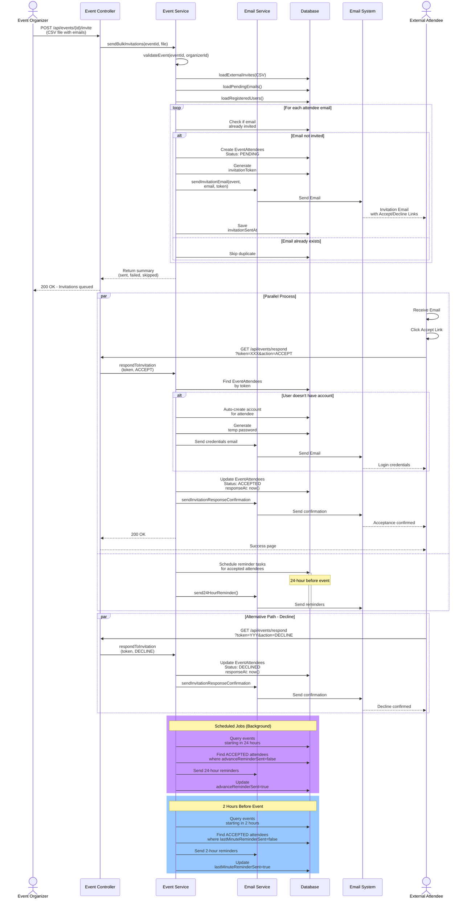
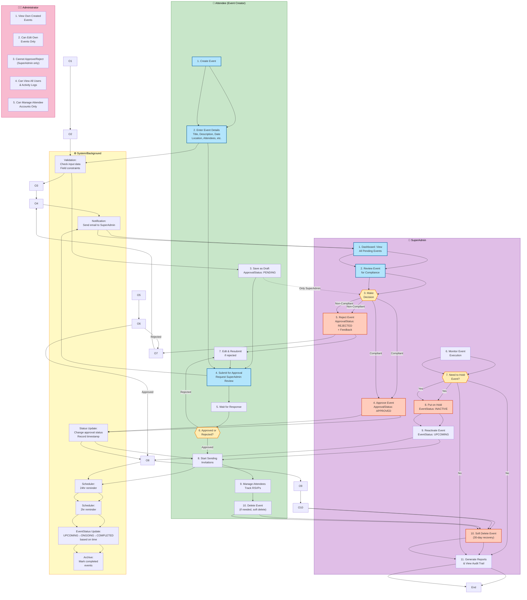

# Event Management System - UML Diagrams

This document contains four UML diagrams for the EventFlow Event Management System:
1. **Use Case Diagram** - Shows actors and their interactions with the system
2. **Activity Diagram** - Shows the workflow of event creation and management
3. **Sequence Diagram** - Shows the interaction between components during event invitation process
4. **Swimlane Diagram** - Shows the event approval workflow across different roles

---

## 1. Use Case Diagram

Simple PlantUML source (recommended): `diagrams/use-case.puml`



---

## 2. Activity Diagram - Event Creation & Management Workflow

```mermaid
graph TD
    Start([Start]) --> Login{User<br/>Authenticated?}
    Login -->|No| LoginPage["Navigate to Login"]
    LoginPage --> Auth["Authenticate User"]
    Auth --> CheckRole{User<br/>Role?}
    
    CheckRole -->|Attendee| AttendeeFlow[\"Attendee Flow\"]
    CheckRole -->|Admin| AdminFlow[\"Admin Flow\"]
    CheckRole -->|SuperAdmin| SuperAdminFlow[\"SuperAdmin Flow\"]
    
    AttendeeFlow --> BrowseOrCreate{Attendee<br/>Action?}
    BrowseOrCreate -->|Browse Events| BrowseEvents[\"Browse Events\"]
    BrowseOrCreate -->|Create Event| CreateEvent[\"Fill Event Details<br/>Title, Description, Date<br/>Location, Capacity, etc.\"]
    
    BrowseEvents --> SearchFilter[\"Search/Filter<br/>by Date/Location/Category\"]
    SearchFilter --> ViewDetails[\"View Event Details\"]
    ViewDetails --> Register{Eligible to<br/>Register?}
    Register -->|Yes - Public| AttendPublic[\"Direct Registration<br/>ACCEPTED\"]
    Register -->|Yes - Private| WaitInvite[\"Wait for<br/>Invitation\"]
    WaitInvite --> ReceiveInvite[\"Receive Invitation<br/>Email\"]
    ReceiveInvite --> RespondInvite{Accept or<br/>Decline?}
    RespondInvite -->|Accept| AcceptFlow[\"Status: ACCEPTED<br/>Send Confirmation\"]
    RespondInvite -->|Decline| DeclineFlow[\"Status: DECLINED<br/>Send Notification\"]
    AttendPublic --> Reminder24[\"Receive 24hr<br/>Reminder\"]
    AcceptFlow --> Reminder24
    Reminder24 --> Reminder2[\"Receive 2hr<br/>Reminder\"]
    Reminder2 --> End1([End - Attendee])
    DeclineFlow --> End2([End - Declined])
    
    CreateEvent --> ValidateInput{Input<br/>Valid?}
    ValidateInput -->|No| ErrorMsg[\"Show Error<br/>Message\"]
    ErrorMsg --> CreateEvent
    ValidateInput -->|Yes| SaveDraft[\"Save as Draft<br/>ApprovalStatus: PENDING<br/>EventStatus: UPCOMING\"]
    SaveDraft --> EditEvent{Continue<br/>Editing?}
    EditEvent -->|Yes| CreateEvent
    EditEvent -->|No| SubmitApproval[\"Submit for Approval\"]
    SubmitApproval --> WaitApproval[\"Wait for SuperAdmin<br/>Approval\"]
    
    AdminFlow --> ViewPending[\"View Created Events<br/>Only Own Events\"]
    ViewPending --> ManageOwn{Own<br/>Event?}
    ManageOwn -->|Yes| EditOwn[\"Edit Event Details\"]
    ManageOwn -->|No| ViewActivity[\"View Activity Logs<br/>& Audit Trail\"]
    EditOwn --> ViewPending
    
    WaitApproval --> CheckStatus{Event<br/>Approved?}
    CheckStatus -->|No| RejectedStatus["ApprovalStatus: REJECTED"]
    CheckStatus -->|Yes| SendInvites["Send Bulk Invitations<br/>via CSV/Email"]
    SendInvites --> TrackResponse["Track RSVP<br/>Responses"]
    TrackResponse --> SendReminders["Auto-send Reminders<br/>24hr & 2hr before"]
    SendReminders --> EventOccurs["Event Occurs<br/>EventStatus: ONGOING"]
    EventOccurs --> Complete["EventStatus: COMPLETED"]
    
    ApprovedStatus["ApprovalStatus: APPROVED<br/>EventStatus: UPCOMING"] --> OptionMenu{"Organizer<br/>Action?"}
    OptionMenu -->|Edit| EditDetails["Edit Event Details"]
    EditDetails --> ApprovedStatus
    OptionMenu -->|Send Invites| SendInvites
    OptionMenu -->|Delete| DeleteEvent["Soft Delete<br/>(recoverable 30 days)"]
    DeleteEvent --> End4([End - Deleted])
    
    SuperAdminFlow["⭐ SuperAdmin Path"] --> ViewAllPending["View All Pending<br/>Events"]
    ViewAllPending --> ReviewSuper["Review Event<br/>Details"]
    ReviewSuper --> DecideSuper{Approve or<br/>Reject?}
    DecideSuper -->|Reject| RejectSuper["ApprovalStatus: REJECTED"]
    DecideSuper -->|Approve| ApproveSuper["ApprovalStatus: APPROVED"]
    ApproveSuper --> ApprovedStatus
    RejectSuper --> RejectedStatus
    ApprovedStatus --> HoldOption{Hold<br/>Event?}
    HoldOption -->|Yes| HoldEvent["Put Event on Hold<br/>EventStatus: INACTIVE"]
    HoldOption -->|No| OptionMenu
    HoldEvent --> ReactivateOption{Reactivate<br/>Later?}
    ReactivateOption -->|Yes| ReactivateEvent["Reactivate Event<br/>EventStatus: UPCOMING"]
    ReactivateEvent --> ApprovedStatus
    ReactivateOption -->|No| End3([End - On Hold])
    
    Complete --> GenerateReport["Generate Analytics<br/>& Reports"]
    GenerateReport --> End5([End - Event Complete])
    
    RejectedStatus --> AppealOption{Appeal<br/>Decision?}
    AppealOption -->|Yes| SubmitAppeal["Submit Appeal<br/>with Details"]
    AppealOption -->|No| End6([End - Rejected])
    SubmitAppeal --> ReviewAppeal["SuperAdmin Reviews<br/>Appeal"]
    ReviewAppeal --> AppealDecision{Appeal<br/>Approved?}
    AppealDecision -->|Yes| ApproveSuper
    AppealDecision -->|No| End6
    
    style Start fill:#90EE90
    style End1 fill:#FFB6C6
    style End2 fill:#FFB6C6
    style End3 fill:#FFB6C6
    style End4 fill:#FFB6C6
    style End5 fill:#FFB6C6
    style End6 fill:#FFB6C6
    style SendInvites fill:#87CEEB
    style SendReminders fill:#87CEEB
    style ApproveSuper fill:#90EE90
    style RejectSuper fill:#FF6B6B
    style SuperAdminFlow fill:#FFE0B2
```

---

## 3. Sequence Diagram - Event Invitation & Response Process



---

## 4. Swimlane Diagram - Event Approval Workflow



---

## Diagram Summary

**System Architecture Overview:**
The EventFlow system implements a Role-Based Access Control (RBAC) model with 3 distinct roles: **Attendee** (event participants), **Admin** (event creators/managers), and **SuperAdmin** (system administrators). Events follow a two-stage status model: **ApprovalStatus** (PENDING → APPROVED/REJECTED) and **EventStatus** (UPCOMING → ONGOING → COMPLETED/CANCELLED, with INACTIVE for holds). **Important**: Each role has separate, non-overlapping permissions - an Attendee cannot create events, and an Admin cannot perform SuperAdmin functions like approving events created by others.

### 1. **Use Case Diagram**
- Shows 3 main actors with distinct roles: **Attendee**, **Admin**, **SuperAdmin**
- **Attendee** (No event creation): Can register for public events, accept/decline invitations, browse events, view event details
- **Admin** (Creates & manages own events): Can create events, manage attendees, send invitations, approve/reject own events, view all events
- **SuperAdmin** (Full system control): Approves/rejects all events, holds/reactivates events, manages users and roles, soft deletes events, views system config and activity logs
- 16 primary use cases clearly separated by actor capability
- Demonstrates strict role separation with different permission levels

### 2. **Activity Diagram**
- Comprehensive workflow covering:
  - **Attendee Path (Browse/Register)**: Search → Filter → View Details → Register → Track Status → Receive Reminders
  - **Admin Path (Create & Manage)**: Create Event → Enter Details → Save Draft → Submit → Wait SuperAdmin Approval → Invite → Track Attendees
  - **Admin Path (Approval)**: Can only approve/reject own events
  - **SuperAdmin Path**: Review all submissions → Approve/Reject → Monitor execution → Hold/Reactivate as needed
- Includes decision points (Approve? Reject? Hold?), validations, and error handling
- Shows automatic event status transitions and scheduler tasks (reminders, status updates)
- **Clear separation**: Attendees register, Admins create, SuperAdmin approves

### 3. **Sequence Diagram**
- Details the invitation and response process:
  - Attendee (event creator) uploads CSV with attendee emails
  - System validates and creates EventAttendees records
  - Invitations sent via email with unique tokens
  - Attendees click links to accept/decline invitations
  - Auto-account creation for external attendees
  - Scheduled reminder emails (24-hour and 2-hour before event)
- Shows synchronous API calls and asynchronous email tasks
- Includes parallel paths for acceptance and decline scenarios

### 4. **Swimlane Diagram**
- Shows complete event approval workflow across 4 swim lanes:
  - **Attendee**: Views public/invited events, registers for events, receives reminders and updates
  - **Admin (Event Creator)**: Creates events, submits for approval, waits for SuperAdmin decision, manages attendees, sends invitations, tracks RSVPs
  - **SuperAdmin**: Reviews all pending events, approves/rejects with feedback, monitors execution, can hold/reactivate, manages soft deletes, generates reports
  - **System**: Validates inputs, sends notifications, updates status timestamps, auto-generates reminders and archives completed events
- Decision points for approval, hold status, and event completion
- Feedback loops for rejected submissions (return to edit/resubmit)
- Color-coded for easy role identification and process type
- **Clear role boundaries**: Attendees register, Admins create, SuperAdmin approves (not Admin)
